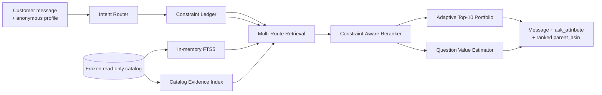

<p align="center">
  
</p>

<h1 align="center">Shopping Copilot — Track 4</h1>

<p align="center"><strong>Team KI</strong></p>

<p align="center">
  <a href="https://github.com/narmi924"></a>
  &nbsp;&nbsp;
  <a href="https://github.com/Nazaket38"></a>
  <br>
  <a href="https://github.com/narmi924">Yimurenijiang Maimaitiming</a>
  &nbsp;·&nbsp;
  <a href="https://github.com/Nazaket38">Nazhakaiti Tuerxun</a>
</p>

Shopping Copilot is an offline-first, state-aware conversational search and recommendation agent for TechJam Track 4. The official headless entry point remains `from starter.agent import Agent`; the FastAPI and React demo is an optional presentation layer over the same deterministic core.

The selected runtime calls no LLM, remote service, model, or production database. Product identifiers always come from the frozen 50,000-item catalog.

## Evaluated result

The unchanged official evaluator completed all 200 public sessions with zero model tokens.

| Metric | Official baseline | Current offline Agent | Absolute change |
|---|---:|---:|---:|
| Hit Rate@10 | 0.125000 | 0.940000 | +0.815000 |
| MRR | 0.068034 | 0.645704 | +0.577670 |
| MTTC (lower is better) | 9.810000 | 3.985000 | -5.825000 |
| Efficiency | 0.119000 | 0.701500 | +0.582500 |
| Recommended TechnicalScore | 0.106710 | 0.804011 | +0.697301 |

| Scenario | Baseline HR@10 | Current HR@10 | Change |
|---|---:|---:|---:|
| Buying | 0.237500 | 0.950000 | +0.712500 |
| Browsing | 0.025000 | 0.962500 | +0.937500 |
| Intent Override | 0.133333 | 0.833333 | +0.700000 |
| Boundary | 0.000000 | 1.000000 | +1.000000 |

The current configuration was selected through isolated component experiments, generic protocol tests, and fixed-seed exact-policy unseen-target simulations intended to reduce public-set overfitting risk. These simulations use the released evaluator with non-public catalog targets; they are not organizer holdouts and are not evidence of private-set performance. Reproduction details and the V1-to-current progression are recorded in [docs/evaluation.md](docs/evaluation.md).

## Architecture



The retrieval routes cover the current message, active constraints, stable context, safe low-weight profile evidence, and high-confidence complete catalog evidence. Session state is isolated by `session_id`; a deterministic `phase3` policy remains available as a fallback. The official evaluator calls only the thin `starter.Agent` adapter and never depends on the demo.

## Project layout

```text
shopping-copilot/
├── data/                    versioned public set + ignored frozen catalog
├── docs/official/           byte-identical official contract and rules
├── evaluator/               byte-identical official evaluator
├── starter/agent.py         thin official-interface adapter
├── src/shopping_copilot/    state, intent, constraints, retrieval, policy
├── tests/                   fast temporary-catalog and API tests
├── scripts/                 catalog, hash, and result verification
├── artifacts/metrics/       compact baseline and current metric summaries
├── demo/backend/            optional thin FastAPI adapter
└── frontend/                optional React + Vite + Ant Design demo
```

## Requirements

- Python `>=3.10` (verified with CPython `3.13.1`)
- uv `0.12.5` or ordinary `venv`/pip
- SQLite with FTS5 (included in the verified Python build)
- Node.js for the optional frontend (verified with Node `24.15.0`, npm `11.1.0`)

The evaluator/core has no third-party runtime dependency. FastAPI, pytest, and frontend packages are optional layers.

## Setup

PowerShell with uv:

```powershell
uv sync --extra test --extra demo
```

Ordinary Python:

```powershell
python -m venv .venv
.venv\Scripts\python.exe -m pip install -e ".[test,demo]"
```

Download `catalog.jsonl.gz` and `SHA256SUMS` from the official [Participant Kit Release](https://github.com/TechJam2026/techjam-conversational-search/releases/tag/participant-kit):

```powershell
$release = "https://github.com/TechJam2026/techjam-conversational-search/releases/download/participant-kit"
Invoke-WebRequest "$release/catalog.jsonl.gz" -OutFile data\catalog.jsonl.gz
Invoke-WebRequest "$release/SHA256SUMS" -OutFile data\SHA256SUMS

$checksumLine = @(Get-Content data\SHA256SUMS | Where-Object { $_ -match "catalog\.jsonl\.gz$" })
if ($checksumLine.Count -ne 1) { throw "catalog.jsonl.gz checksum entry not found" }
$expected = ($checksumLine[0] -split "\s+")[0].ToLowerInvariant()
$actual = (Get-FileHash data\catalog.jsonl.gz -Algorithm SHA256).Hash.ToLowerInvariant()
if ($actual -ne $expected) { throw "catalog.jsonl.gz checksum mismatch" }
```

After the checksum passes, decompress the catalog with the Python standard library:

```powershell
@'
import gzip
import shutil
from pathlib import Path

source = Path("data/catalog.jsonl.gz")
target = Path("data/catalog.jsonl")
with gzip.open(source, "rb") as compressed, target.open("wb") as output:
    shutil.copyfileobj(compressed, output)
'@ | uv run python -
```

The expected uncompressed SHA256 is `da979b05a68af864cb0dcf9ee6a81c010c7e66a57978ad286c7a2e005fc69a67`. `data/catalog.jsonl` is required locally but ignored by Git and must not be committed.

Verify the decompressed file before loading it:

```powershell
$expectedCatalog = "da979b05a68af864cb0dcf9ee6a81c010c7e66a57978ad286c7a2e005fc69a67"
$actualCatalog = (Get-FileHash data\catalog.jsonl -Algorithm SHA256).Hash.ToLowerInvariant()
if ($actualCatalog -ne $expectedCatalog) { throw "catalog.jsonl checksum mismatch" }
```

Validate its row count, identifiers, visible fields, and SHA256 without printing product records:

```powershell
uv run python scripts\inspect_catalog.py data\catalog.jsonl
```

## Canonical Agent usage

The official evaluator imports the Python Agent directly. No HTTP server, hosted endpoint, container, or frontend is required for scoring.

```python
from starter.agent import Agent

agent = Agent(catalog_path="data/catalog.jsonl")

agent.reset(
    session_id="demo-session",
    user_profile={
        "purchase_frequency": "occasional",
        "average_prior_rating": 4.2,
        "rating_style": "selective",
        "preference_tags": ["comfortable", "travel"],
        "summary": "Prefers practical products for daily use.",
    },
)

response = agent.respond(
    session_id="demo-session",
    user_message="I need shoes for a trip.",
    turn=1,
    top_k=10,
)

print(response)
```

The response follows the official contract. The text, selected question, and identifiers below are representative placeholders; actual values depend on the conversation and catalog:

```python
{
    "message": "I found several options. What other requirement matters most?",
    "ask_attribute": "other",
    "recommendations": [
        {"parent_asin": "B0..."},
        {"parent_asin": "B0..."},
    ],
    "usage": {
        "prompt_tokens": 0,
        "completion_tokens": 0,
    },
}
```

`ask_attribute` is either `None` or one of:

```text
category, material, color, size, style, brand,
budget, feature, use_case, other
```

The Agent may ask a clarification question and return recommendations in the same turn. The evaluator replies according to the structured `ask_attribute` value; it does not infer the requested attribute from `message`. With the official `top_k=10`, the Agent returns at most 10 unique, catalog-valid `parent_asin` values. The FastAPI and React application is an optional demo over this same Agent core.

```text
Canonical / official:  Python Agent.reset() + Agent.respond()
Official evaluation:   python -m evaluator.local_evaluator
Optional presentation: FastAPI + React
```

## Test and evaluate

```powershell
uv run --extra test --extra demo python -m pytest
uv run python -m evaluator.local_evaluator
uv run python scripts\verify_official_files.py
```

The adapter resolves `src` with `pathlib.Path`, so an installed project also works with ordinary `python -m evaluator.local_evaluator`.

For final evaluation, the Devpost-submitted commit is frozen. After the post-deadline final package is released, teams must run its unmodified official evaluator against that commit and retain the complete generated results and relevant environment and execution details. See the byte-identical [official final-evaluation FAQ](docs/official/final_evaluation_faq.md).

## Run the optional demo

Terminal 1:

```powershell
uv run --extra demo uvicorn demo.backend.app:app --host 127.0.0.1 --port 8000
```

Terminal 2:

```powershell
Set-Location frontend
npm ci
npm run dev -- --host 127.0.0.1
```

Open `http://127.0.0.1:5173`. The UI provides conversation, enriched Top 10 product cards, a live Agent state/debug panel, and baseline/current evaluation metrics. It never participates in official evaluation.

## Implemented

- isolated `SessionState`, safe profile copies, deterministic reset semantics, and bounded diagnostics;
- history-aware current/constraint/stable/profile retrieval routes;
- Buying, Browsing, and Intent Override routing with slot-aware attribute/category replacement;
- explicit negative constraints, constraint provenance, and bounded dual hypotheses for ambiguous overrides;
- distinct declined and exhausted attribute state, so no-preference retracts a slot while no-additional-preference preserves its evidence;
- in-memory SQLite FTS5, strict and broad retrieval tracks, weighted RRF, and bounded constraint-coverage reranking;
- a read-only Catalog Evidence Fingerprint index for high-confidence matching of complete catalog-visible feature, detail, material, color, and budget clauses;
- read-only catalog facets for category, brand, color, material, style, size, price bands, features, and use cases;
- candidate-aware clarification based on metadata coverage, partition gain, route relevance, prior questions, declines, and remaining turns;
- an adaptive Top-10 portfolio that protects high ranks and uses lower slots for bounded facet coverage when the route is uncertain;
- structured budget scoring, deterministic fallbacks, catalog membership validation, and deduplication;
- clarification that stops exhausted slots, permits at most two useful `other` questions, and always accompanies recommendations when candidates exist;
- optional FastAPI session adapter and React demo using the same Agent instance contract.

## Not implemented

- dense embeddings or dense retrieval;
- neural semantic reranking;
- external LLM calls in the selected runtime;
- production authentication, commerce, inventory, or database services.

## Disclosure and contributions

| Item | Disclosure |
|---|---|
| Core runtime | Python standard library and SQLite FTS5 |
| Selected runtime models and APIs | None |
| Selected runtime network use | None |
| Selected runtime model tokens | 0 prompt tokens and 0 completion tokens |
| Selected runtime external-service cost | US$0 |
| Development-only API experiment | Guarded DeepSeek candidate reranker; rejected and not included in the selected runtime |
| Approximate development experiment cost | US$2.08 |
| Optional demo | FastAPI, React, Vite, and Ant Design |
| Development and checks | uv, pytest, GitHub Actions, Node.js/npm |
| Dataset | Frozen 50,000-item catalog and public sessions from the official Participant Kit; see [DATA_ATTRIBUTION.md](DATA_ATTRIBUTION.md) |
| Canonical evaluator resources | 70.288 seconds; approximately 642.070 MiB peak process-tree working set |
| Submission-hardening suite | 78 passing tests plus the frontend production build |

An LLM reranker was tested during development, but its small screening gain did not pass the larger generalization and structured-output reliability gates. The final system therefore remains deterministic, offline, and zero-token. See the publication-safe [aggregate experiment note](docs/experiments/deepseek-rerank.md).

Shopping Copilot is a Team KI entry. [Yimurenijiang Maimaitiming](https://github.com/narmi924) leads the implementation, evaluation and demo; [Nazhakaiti Tuerxun](https://github.com/Nazaket38) contributes to Frontend UI/UX design and documentation.

## Limitations

The slot vocabulary and regex rules cannot resolve every paraphrase, lexical retrieval cannot bridge arbitrary synonyms, and missing catalog prices limit strict budget filtering. Candidate facets and evidence matches are intentionally conservative when catalog metadata is missing. The first Agent construction loads the catalog and builds both FTS5 and evidence indexes in memory; later turns benefit from bounded deterministic query, document, and facet caches.

This repository excludes the catalog, secrets, virtual environments, caches, `results.json`, `node_modules`, and frontend build output.
