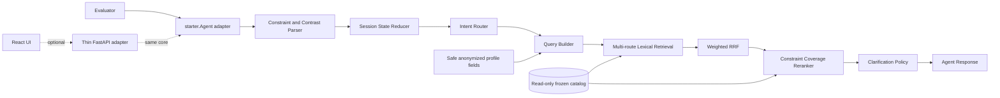

# Architecture

Shopping Copilot is a deterministic local pipeline. The official entry point remains `starter.Agent`; all search behavior lives under `src/shopping_copilot`. FastAPI and React are optional consumers and are outside the official execution path.

## Trust and data boundary

The Agent can see only:

- the random `session_id` and anonymized `user_profile` passed to `reset`;
- `user_message`, `turn`, and `top_k` passed to `respond`;
- participant-visible fields from the frozen catalog.

Only `preference_tags` and `summary` contribute to the low-weight profile route. Unknown profile fields are copied safely but never queried.

The Agent cannot see and never reads `public_set.jsonl`, `ground_truth`, `intent_card`, `behavior`, `scenario_type`, evaluator state, or evaluator implementation details at runtime. It imports no evaluator module and derives no identifier outside the frozen catalog.

The catalog is parsed once during `CatalogIndex` construction. Immutable product dataclasses sit behind a read-only mapping; SQLite FTS5 is built in memory and switched to query-only mode. The catalog JSONL is never modified. Bounded LRU-style caches memoize deterministic searches and product term sets without changing ranking.

The copied evaluator, public set, API contract, and evaluation config are protected by recorded SHA256 values. The official labels and evaluator are never modified.

## State and override boundary

Normalization and contrast parsing happen before the state reducer. An override marker is routed before ordinary accumulation. Each constraint records its slot, value, source turn, status, confidence, and dialogue origin. The reducer then:

1. separates old and new clauses for general contrast patterns;
2. classifies attribute, category, global, negative, and ambiguous replacements;
3. moves replaced values to `superseded_constraints` and rejected values to `negative_constraints`;
4. preserves compatible category, use case, material, color, and budget context;
5. clears category-dependent size/style/brand/feature slots on a category switch;
6. creates bounded attribute and category hypotheses when the replacement scope is ambiguous;
7. records the event and exposes only the reduced active state to the Query Builder.

Superseded terms therefore do not enter the active-constraint route. A no-preference reply follows a separate transition: it clears the relevant attribute, records it as declined, emits no current-message terms, and leaves unrelated valid history intact.

## Retrieval and ranking

| Route | Source | Weight | Purpose |
|---|---|---:|---|
| Current | latest meaningful user terms | 4.50 / 6.00 on override | newest explicit need wins |
| Constraints | active non-superseded slots | 3.00 / 3.20 on override | preserve useful multi-turn detail |
| Stable | category and use case | 1.80 / 1.20 on override | retain the product domain without dominating a change |
| Profile | safe preference tags and summary | 0.35 / 0.20 on override | weak personalization only |
| Attribute hypothesis | ambiguous override only | 4.00 | test a local slot replacement |
| Category hypothesis | ambiguous override only | 2.60 | test a category replacement conservatively |

Each route retrieves independently from FTS5. Buying/Browsing turns may add an all-terms precision track; override turns stay on broad fusion for that response. Weighted Reciprocal Rank Fusion deduplicates by identifier and orders by fused score, best route rank, then `parent_asin`.

A bounded reranker combines the fused rank with current-message coverage, active slot coverage, stable context, and structured budget evidence. Override turns additionally reward current-turn slot coverage and apply capped penalties for explicit negative and most recently superseded values. These are ranking signals, not hard catalog exclusions, so one uncertain parse cannot remove the candidate pool. The clarification policy asks about category or another requirement when replacement scope remains ambiguous, while still returning the ranked Top K.

## Optional presentation path

The FastAPI service owns only demo session counters, response enrichment, and access serialization. It calls the same `Agent.reset()` and `Agent.respond()` methods as the evaluator. The React client renders conversation, Top 10 cards, safe Agent diagnostics, and saved metric artifacts. Removing `demo/` and `frontend/` leaves the official core fully functional.
